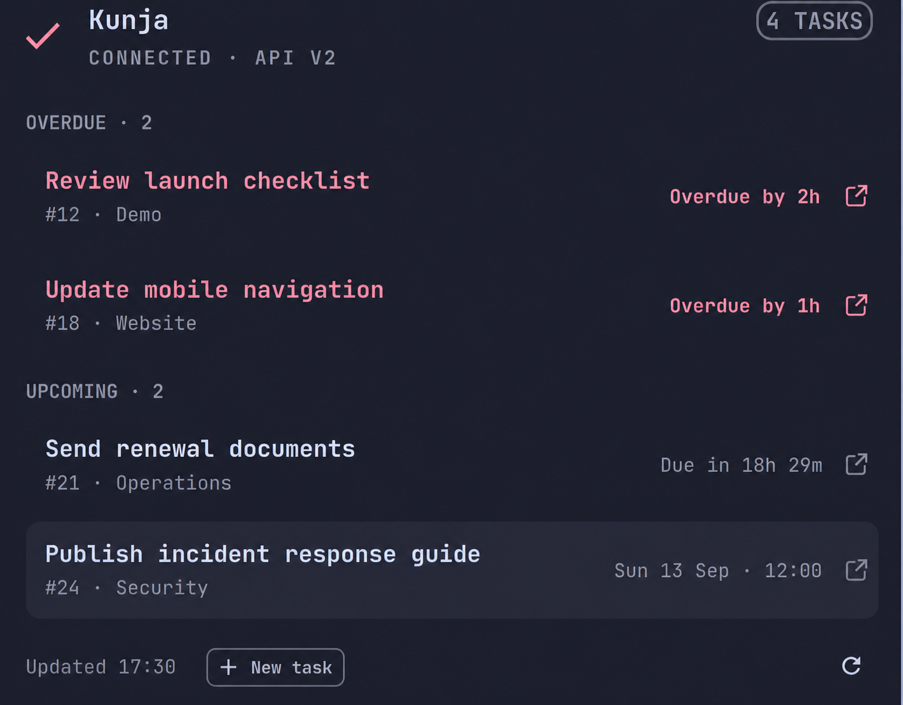

# Kunja

Kunja is an Omarchy 4 shell plugin that keeps your assigned Vikunja work in the bar. Its compact status shows the next due task and a small count badge, then opens a native panel grouped into **Overdue**, **Today**, and **Upcoming**.



Overdue work gets a warning icon, an overdue-count badge, and clearly marked rows. Open any task in Vikunja, or create a task without leaving the panel. Deadlines entering the configured reminder window produce one Omarchy desktop notification.

## Requirements

- Omarchy 4 with shell plugins
- Python 3, `secret-tool`, `xdg-terminal-exec`, and `xdg-open` (included in a standard Omarchy install)
- A Vikunja account that can create an API token

## Vikunja token

Kunja's setup wizard can open the correct page for you. When Vikunja asks for permissions, grant only:

- **Tasks → Read All, Create**
- **Projects → Read All, Users Search**
- **Tasks Assignees → Create**

Name the token `Kunja` so it is easy to recognize later. Vikunja shows the token value only once, immediately after creation, so copy it before closing the page.

## Install and configure

Install Kunja from its public repository and enable it in the Omarchy bar:

```bash
omarchy plugin add https://github.com/Guzzy711/kunja.git --enable
```

For local development, link or copy the checkout into `~/.config/omarchy/plugins/io.github.guzzy711.kunja`, rescan the plugins, and enable it:

```bash
omarchy plugin validate .
omarchy-shell shell rescanPlugins
omarchy plugin enable io.github.guzzy711.kunja --section right
```

Click the Kunja bar item and select **Start setup**. The guided flow:

1. Asks for the HTTPS address you use to open Vikunja.
2. Offers to open Vikunja's API token settings in your browser.
3. Explains the minimum scoped permissions and accepts the token with hidden input.
4. Tests the connection before saving anything.

You can also run configuration directly from this checkout:

```bash
python3 bin/kunja configure
```

For automation, skip the URL prompt with:

```bash
python3 bin/kunja configure --endpoint https://vikunja.example.com
```

Add `--no-open-browser` to print the token-settings link without opening it. The setup detects API v2 or the v1 compatibility path, validates task and project access, and only then saves the connection.

## Using the widget

- **Left click:** open or close the task panel
- **Middle click:** refresh immediately
- **Up/Down:** move through task rows
- **Enter** or **O:** open the selected task
- **N:** create a task
- **R:** refresh
- **Escape:** close the panel

The creation form includes a required title, writable project, optional project-member assignee, required due date and time, priority, and optional description. Kunja selects the first writable project and prefers your connected Vikunja user as the assignee when that user belongs to the project. Your final selection replaces the complete assignee set, so the displayed employee is the task's only assignee. Choose **Unassigned** when no owner is needed.

After creation, Kunja refreshes the watched list and shows a confirmation with **Open in Vikunja**. If the task is created but assigning it fails, the task is kept and the confirmation explains the partial result.

The default task query includes incomplete tasks assigned to the current user that have a due date before `now+14d`. Overdue tasks remain visible; tasks without due dates are excluded.

Settings are available from Omarchy's bar settings:

- Refresh interval: 5 minutes
- Due horizon: 14 days
- Reminder lead time: 60 minutes (`0` disables reminders)
- Maximum panel tasks: 50

## Security and local data

The Vikunja API token is stored with libsecret under the `kunja` service. Non-secret connection metadata is stored with mode `0600` in:

```text
~/.config/kunja/config.json
```

The last successful task snapshot and reminder deduplication state are stored under:

```text
~/.local/state/kunja/
```

The cache contains task titles and deadlines but not the API token. If a refresh fails, the panel retains this last successful snapshot and marks it as cached.

Remove the stored token without uninstalling Kunja with:

```bash
python3 bin/kunja clear-credentials
```

## Uninstall

Clear the Vikunja token first, while Kunja's credential helper is still installed, and then remove the plugin:

```bash
python3 ~/.config/omarchy/plugins/io.github.guzzy711.kunja/bin/kunja clear-credentials
omarchy plugin remove io.github.guzzy711.kunja
```

Your non-secret connection settings and cached task snapshot remain in `~/.config/kunja/` and `~/.local/state/kunja/`. They can be removed separately if you do not plan to reinstall Kunja.

## Troubleshooting

Run a foreground sync to see the normalized status document:

```bash
python3 bin/kunja sync
```

Common errors are reported separately:

- **Vikunja rejected the API token:** create or rotate the Vikunja API token.
- **Insufficient permissions while watching:** add **Tasks → Read All** and **Projects → Read All**.
- **Projects or members do not load:** add **Projects → Users Search**.
- **Task creation or assignment fails:** add **Tasks → Create** and **Tasks Assignees → Create**.
- **Missing keyring:** verify `secret-tool` works in the graphical Omarchy session.

## Development

Run all helper tests, QML model tests, linting, and manifest validation:

```bash
tests/run.sh
```

Watching supports Vikunja API v2 and the v1 compatibility path. Creating tasks from Kunja requires Vikunja API v2.
